# Progetto Programmazione Avanzata Anno Accademico 2024-2025
<div align="center">
  
</div>

# Indice
- [🎯 Obiettivo del progetto]
- [⚙️ Setup e installazione]
- [🧩 Progettazione]
    - [🏗️ Architettura]
    - [👤 Diagramma dei casi d'uso]
    - [🗄 Diagramma E-R]
    - [📐 Pattern Utilizzati]
    - [↔️ Diagrammi delle sequenze]
- [🌐 Rotte API]
- [📝 Scelte implementative]
- [🛠️ Strumenti utilizzati]
- [👨‍💻 Autori]

---

## Obiettivo

L’obiettivo del progetto è lo sviluppo di un **sistema back-end per la gestione e la distribuzione di beni digitali storici** (immagini e video relativi a manoscritti, cartografie, documenti d’archivio, ecc.).  
Il sistema consente agli utenti autenticati di **acquistare, scaricare e regalare beni digitali** oltre a permettere la gestione dei token per l'acquisto dei beni (credito residuo e ricarica token).

Le principali funzionalità previste dal backend includono:

- **Gestione catalogo beni digitali**: caricamento da parte dell’amministratore e consultazione libera con filtri su tipologia, anno e formato.
- **Acquisto beni**: pagamento tramite token e generazione di un link univoco per il download in un formato a scelta, con applicazione automatica di una filigrana.
- **Gestione download**: link valido per un solo utilizzo, possibilità di richiederne uno nuovo a costo ridotto.
- **Regali digitali**: possibilità di donare un bene ad un altro utente, con generazione di un link aggiuntivo.
- **Acquisti multipli**: supporto al download in formato compresso `.zip`, con filigrana applicata ad ogni contenuto incluso.
- **Storico acquisti**: consultabile dall’utente in formato JSON o PDF, distinto per tipologia (standard, aggiuntivi, regali).
- **Gestione crediti**: ogni utente dispone di un saldo in token, ricaricabile dall’amministratore.

Il progetto è sviluppato in **TypeScript** utilizzando **Node.js, Express e Sequelize** e **PostgreSQL** come RDBMS. Prevede inoltre l’impiego di librerie esterne per la gestione dei formati multimediali e della filigrana.

---

## Setup e installazione

Per l'installazione e la configurazione del progetto è necessario avere installati [Docker](https://www.docker.com/) e [docker-compose](https://docs.docker.com/compose/).

Successivamente, bisogna clonare il repository e avviare i servizi. Ecco i comandi da eseguire nel terminale:

```bash
# Clona il repository
git clone https://github.com/matteorisolo/ProgettoPA

# Entra nella cartella del progetto
cd ProgettoPA

# Copia il file di configurazione '.env' nella directory principale
# (Assicurati di impostare correttamente le variabili)

# Avvia il progetto tramite Docker Compose
docker-compose up --build
```

Una volta avviato, il sistema sarà disponibile all'indirizzo: http://127.0.0.1:3000. Le rotte API possono essere testate utilizzando Postman con la collection fornita nella repository.

---

## Progettazione

### Architettura

Il sistema adotta un'architettura **client-server** su più livelli:

```mermaid
flowchart TB
    A[👨‍💻<br>Utente] -->|Richiesta HTTP<br>GET/POST| B_Group

    subgraph B_Group[ ]
        direction TB
        B_Title[<b>🔄 API SERVER EXPRESS</b>]
        B1[🔐 Autenticazione JWT]
        B2[✓ Validazione richieste]
        B3[🛣️ Rotte e Controller]
    end

    B_Group -->|📋 Dati validati| C_Group

    subgraph C_Group[ ]
        direction TB
        C_Title[<b>⚙️ BACKEND</b>]
        C1[💰 Gestione acquisti, regali, token]
        C2[🖼️ Elaborazione immagini/video + filigrana]
        C3[📄 Generazione PDF e ZIP]
    end
    
    C_Group -->|🗃️ Query dati| D_Group

    subgraph D_Group[ ]
        direction TB
        D_Title[<b>💾 DATABASE</b>]
        D1[🗄️ Beni digitali]
        D2[📊 Storico acquisti e token]
    end
    
    D_Group -->|📊 Risultati query| C_Group
    C_Group -->|📦 Risposta elaborata| B_Group
    B_Group -->|📨 Risposta HTTP| A

    %% Stili per nascondere i bordi dei titoli
    style B_Title fill:none,stroke:none
    style C_Title fill:none,stroke:none
    style D_Title fill:none,stroke:none
    
    %% Stili per i box principali (ridotti di altezza)
    class B_Group,C_Group,D_Group fill:#f9f9f9,stroke:#333,stroke-width:2px,height:40px
    class A fill:#e1f5fe,stroke:#01579b,stroke-width:2px,height:20px

    %% Titoli più grandi
    style B_Title font-size:22px
    style C_Title font-size:22px
    style D_Title font-size:22px

    %% Elementi interni più piccoli
    style B1 font-size:14px
    style B2 font-size:14px
    style B3 font-size:14px
    style C1 font-size:14px
    style C2 font-size:14px
    style C3 font-size:14px
    style D1 font-size:14px
    style D2 font-size:14px
    style A font-size:18px
    
    %% Testi frecce più piccoli
    linkStyle default stroke-width:1px,font-size:14px
```



Nel dettaglio:
- **Utente**: 
  - Autenticato tramite **JWT**.
  - Può effettuare richieste per:
    - Consultare catalogo beni digitali.
    - Acquistare beni singoli o multipli.
    - Scaricare prodotti con link unico.
    - Richiedere filigrane e download aggiuntivi.
    - Effettuare regali digitali.

- **API Server (Express.js)**:
  - Gestisce le **rotte REST** e le validazioni.
  - Controlla autenticazione e autorizzazione tramite middleware.
  - Smista le richieste verso i servizi del backend.

- **Backend (Node.js)**:
  - Gestisce la **logica applicativa**:
    - Controllo credito token.
    - Creazione di acquisti e download.
    - Applicazione filigrane su immagini e video.
    - Generazione di link univoci e ZIP per acquisti multipli.
    - Preparazione di PDF e JSON per lo storico acquisti.
  - Interagisce con i repository per il database.

- **Database (PostgreSQL via Sequelize)**:
  - Memorizza:
    - Utenti, ruoli e token disponibili.
    - Prodotti digitali e metadati.
    - Acquisti, download e link univoci.
  - Garantisce persistenza e integrità dei dati.

La struttura delle cartelle riflette l’architettura multilayer del progetto, garantendo separazione delle responsabilità e manutenibilità:
```bash
ProgettoPA
├── backend
│   ├── fonts                   # font utilizzati per la generazione della filigrana
│   ├── src
│   │   ├── controllers         # gestiscono le richieste HTTP e orchestrano i servizi
│   │   ├── dao                 # data access objects, logica diretta di accesso ai dati
│   │   ├── enums               # enumerazioni centralizzate (ruoli, tipi di acquisto, ecc.)
│   │   ├── middlewares         # middleware Express (autenticazione JWT, validazioni, error handling)
│   │   ├── models              # definizione dei modelli Sequelize
│   │   ├── repositories        # livello di persistenza, astrazione sul database
│   │   ├── routes              # definizione delle rotte e collegamento ai controller
│   │   ├── services            # logica applicativa (gestione acquisti, generazione file, ecc.)
│   │   ├── utils               # funzioni di utilità (generazione PDF, gestione errori, utils JWT, connessione al db)
│   │   ├── app.ts              # configurazione Express (middleware, rotte, ecc.)
│   │   └── server.ts           # entrypoint per avvio del server
│   ├── Dockerfile
│   ├── eslint.config.mjs       # configurazione linting
│   ├── package-lock.json
│   ├── package.json
│   └── tsconfig.json
├── db
│   └── init.sql                # script iniziale per creazione schema e seed del database
├── images                      # risorse statiche o immagini di documentazione
├── collection                  # Postman collection per testare le API
├── docker-compose.yml          # orchestrazione dei container (backend, e db)
├── README.md
├── LICENSE
```

Nel dettaglio:
- **controllers** → gestiscono le richieste HTTP e orchestrano i servizi.  
- **routes** → mappano gli endpoint verso i rispettivi controller.  
- **middlewares** → centralizzano la gestione di autenticazione, validazioni e gestione errori.  
- **services** → implementano la logica applicativa (acquisti, download, regali, generazione file).  
- **dao** e **repositories** → separano l’accesso ai dati dalla logica di business.  
- **models** → definiscono le entità e relazioni tramite Sequelize.  
- **utils** → forniscono funzionalità trasversali.  
- **fonts** → raccoglie i font utilizzati per la generazione della filigrana.  
- **app.ts** e **server.ts** → gestiscono rispettivamente la configurazione dell’applicazione Express e l’avvio del server.

Altre directory:
- **db** → contiene lo script SQL di inizializzazione del database.  
- **collection** → include la Postman Collection per testare le API.  
- **docker-compose.yml** → gestione dei container per backend e database.

---

### Diagramma dei casi d'uso

Il sistema prevede tre attori principali:

- **👤 Utente Non Autenticato**: può esclusivamente consultare il catalogo dei beni disponibili.  
- **👤 Utente Registrato**: può autenticarsi e accedere a tutte le funzionalità di acquisto, download e gestione del proprio credito.  
- **👑 Amministratore**: ha privilegi avanzati per la gestione del catalogo e del credito utenti, oltre alle funzionalità comuni agli utenti.

#### Casi d’uso principali

- **Utente non autenticato**  
  - Visualizzare i beni disponibili.

- **Utente registrato**  
  - Effettuare login.  
  - Acquistare un bene digitale *(con validazione del pagamento)*.  
  - Scaricare un bene acquistato *(con applicazione della filigrana)*.  
  - Richiedere un nuovo link di download.  
  - Visualizzare lo storico acquisti.  
  - Effettuare acquisti multipli con generazione di un archivio ZIP.  
  - Regalare un bene digitale *(indicando l’email del destinatario)*.  
  - Consultare il proprio credito residuo.

- **Amministratore**  
  - Caricare nuovi beni digitali nel catalogo.  
  - Ricaricare il credito di un utente.  
  - Accedere alle funzionalità comuni di visualizzazione catalogo e gestione credito.

#### Relazioni di inclusione

Alcuni casi d’uso includono sotto-funzionalità specifiche:  
- L’acquisto richiede la **validazione del pagamento**.  
- Il download comporta l’**applicazione della filigrana** al bene digitale.  
- Gli acquisti multipli comportano la **generazione di un archivio ZIP**.

Il diagramma seguente illustra graficamente gli attori, i casi d’uso e le relative relazioni di inclusione:

```mermaid
flowchart TD
    %% Attori
    Anon[👤 Utente Non Autenticato]
    U[👤 Utente Registrato]
    A[👑 Amministratore]

    %% Layout ordinato per righe
    Anon --> UC1[Visualizzare beni disponibili]
    U --> UC1
    A --> UC1

    U --> UC2[Effettuare login]
    U --> UC3[Acquistare bene digitale]
    U --> UC4[Scaricare bene acquistato]
    U --> UC5[Richiedere nuovo link]
    U --> UC6[Visualizzare acquisti]
    U --> UC7[Acquisti multipli ZIP]
    U --> UC8[Regalare bene]
    U --> UC9[Visualizzare credito]

    A --> UC10[Caricare nuovi beni]
    A --> UC11[Ricaricare credito utente]
    A --> UC2
    A --> UC9

    %% Relazioni di inclusione (separate) - RIMOSSO Invio email
    UC3 --> ValPag[Validazione pagamento]
    UC4 --> ApplFil[Applicazione filigrana]
    UC7 --> GenZip[Generazione ZIP]

    %% Stili per chiarire le relazioni - CORRETTE
    linkStyle 0 stroke:green,stroke-width:2px
    linkStyle 1 stroke:blue,stroke-width:2px
    linkStyle 2 stroke:red,stroke-width:2px
    linkStyle 3,4,5,6,7,8,9,10 stroke:blue,stroke-width:2px
    linkStyle 11,12 stroke:red,stroke-width:2px
    linkStyle 13,14 stroke:orange,stroke-width:2px
    linkStyle 15,16,17 stroke:purple,stroke-width:2px,dashed

    classDef anon fill:#e8f5e9,stroke:#2e7d32
    classDef user fill:#e3f2fd,stroke:#1565c0
    classDef admin fill:#fce4ec,stroke:#c2185b
    classDef useCase fill:#f5f5f5,stroke:#424242
    classDef include fill:#fff3e0,stroke:#ef6c00

    class Anon anon
    class U user
    class A admin
    class UC1,UC2,UC3,UC4,UC5,UC6,UC7,UC8,UC9,UC10,UC11 useCase
    class ValPag,ApplFil,GenZip include
```



---

### DIagramma E-R

## 🗂️ Diagramma E-R

## 🗂️ Diagramma E-R

Il diagramma E-R mostra la struttura dei dati principali del sistema e le relazioni tra di essi.

- Gli **utenti** rappresentano le persone che utilizzano il sistema, con ruoli differenti (utente normale o amministratore). Gli utenti hanno un saldo di token che viene aggiornato in base agli acquisti e alle ricariche.

- I **prodotti** sono i beni digitali disponibili, come immagini e video storici. La scelta di utilizzare **enum** per tipo di prodotto e formato consente di limitare i valori possibili e mantenere la coerenza dei dati. Il campo `path` indica il percorso fisico del file sul server, necessario per recuperare e servire correttamente il bene.

- Gli **acquisti** registrano le transazioni degli utenti. Oltre al `buyerId`, viene salvato anche il `recipientEmail` quando il bene viene regalato: questa scelta, seppur ridondante, permette di tenere traccia dell'email del ricevente regalo, indicata al momento dell'acquisto del regalo, garantendo di conservare sempre questo riferimento anche se poi in futuro l'email dovesse cambiare. L’enum `type` distingue tra acquisti standard, download aggiuntivi e regali.

- I **download** gestiscono i link univoci per scaricare i prodotti. Anche se più download possono avere lo stesso `download_url` (come nel caso di acquisti multipli (bundle)), la ridondanza viene accettata per semplicità e per soddisfare le regole del programma, evitando di dover creare una tabella separata tipo “lista acquisti” per gestire una relazione molti-a-molti, considerato anche che la funzionalità degli acquisti in bundle, per il tipo di servizio che il backend offre (beni storici digitali), probabilmente è più marginale. I download registrano chi ha utilizzato il link (buyer o recipient), se fa parte di un bundle e la scadenza del link, garantendo il controllo degli accessi e la corretta gestione dei token.

Questa struttura, seppur semplice, permette di tracciare con precisione gli acquisti, i regali e i download, mantenendo al contempo il sistema flessibile e facilmente estendibile.


---

### Pattern utilizzati

## Pattern Utilizzati

Per garantire modularità, chiarezza e facilità di manutenzione, nel progetto sono stati adottati diversi design pattern. Di seguito quelli principali e i vantaggi apportati.

### Singleton
Alcuni servizi o configurazioni devono avere un’unica istanza condivisa in tutto il sistema.  
Il pattern Singleton è stato utilizzato per garantire coerenza e accessibilità globale senza duplicare oggetti o configurazioni. Questo è il caso per esempio della classe *Database* per la connessione allo stesso che deve appunto essere unica (istanza di Sequelize).

### Factory
Per la gestione centralizzata degli errori HTTP nel progetto è stato adottato il **pattern Factory**. L’idea principale è avere un’unica classe (la factory) che si occupa di **creare oggetti errore personalizzati** in base al contesto in cui si verifica l’errore.  

In pratica, ogni volta che nel codice si incontra una situazione anomala (ad esempio un utente non autorizzato, un acquisto non trovato, o dati non validi), si chiama la factory fornendo:  
- il **tipo di errore** (ad esempio `NotFound`, `Forbidden`, `BadRequest`),  
- un **messaggio descrittivo** che spiega il problema,  
- eventualmente altri parametri utili al logging o alla gestione interna.  

La factory genera quindi un’istanza di errore HTTP coerente, con codice e messaggio corretti, che viene poi propagata attraverso i middleware di Express fino al client.

### COR (Chain of Responsibility)
Il **pattern Chain of Responsibility (COR)** è stato implementato principalmente attraverso i middleware di Express. In questo pattern, ogni middleware rappresenta un "anello della catena" che può decidere di **gestire la richiesta** oppure di **passarla al middleware successivo**, permettendo così un flusso modulare e flessibile.

Nel progetto, il COR è stato applicato ai seguenti casi:  
- **Autenticazione e autorizzazione JWT**: verifica se l’utente è autenticato e ha i permessi necessari. Se la richiesta non è valida, viene bloccata e restituito un errore; altrimenti, la richiesta continua lungo la catena.  
- **Validazione delle richieste**: controlla che parametri e body rispettino i vincoli previsti (es. array di prodotti, email valide, token disponibili). In caso di errori di validazione, la richiesta viene interrotta.  
- **Gestione centralizzata degli errori**: intercetta eventuali eccezioni sollevate dai middleware precedenti o dai controller, trasformandole in risposte HTTP coerenti, sfruttando la factory per la creazione degli errori.

I principali vantaggi di questo approccio sono:  
1. **Modularità**: ogni controllo è indipendente e concentrato in un unico middleware.  
2. **Estendibilità**: è possibile aggiungere nuovi controlli o modificare quelli esistenti senza toccare il resto della logica.  
3. **Pulizia del codice**: si evita la nidificazione di if complessi e la duplicazione di controlli in più punti.  
4. **Gestione centralizzata degli errori**: tutti gli errori passano attraverso uno stesso flusso, garantendo uniformità nella risposta e semplificando il logging.

In sintesi, il COR nei middleware consente di costruire una pipeline di controlli chiara, scalabile e facilmente manutenibile, adatta a gestire autenticazione, validazioni e errori in maniera coerente.

### MVC (Model-View-Controller)
Il **pattern MVC (Model-View-Controller)** è stato implementato per organizzare l'applicazione in livelli distinti, migliorando chiarezza e manutenibilità.

- **Modelli (Model)**: definiscono le entità principali del sistema come utenti, prodotti, acquisti e download. Grazie a Sequelize, i modelli gestiscono le relazioni e le regole di integrità dei dati, senza occuparsi della logica applicativa.  

- **Controller (Controller)**: sono responsabili di coordinare le richieste HTTP e collegare i vari servizi e repository. Non eseguono query dirette al database; si limitano a orchestrare le operazioni necessarie per completare l’azione richiesta.  

- **Vista (View)**: la vista corrisponde alle risposte JSON o ai file forniti al client. Gestisce la presentazione dei dati, separandoli dalla logica di business e dall’accesso ai dati.  

Questo approccio consente di mantenere il codice:
- **Chiaro e modulare**, con responsabilità ben definite.  
- **Facile da testare**, in quanto ogni livello può essere verificato separatamente.  
- **Estendibile**, perché nuove funzionalità possono essere aggiunte senza modificare componenti esistenti.  
- **Sicuro e affidabile**, poiché la logica critica è isolata nei controller e nei servizi.

### DAO (Data Access Object)
I DAO isolano le operazioni di accesso al database per ciascuna entità.  
Vantaggi:
- Migliorano testabilità e manutenzione.  
- Permettono di cambiare la tecnologia sottostante senza alterare la logica applicativa.

### Repository
I Repository aggregano più DAO e gestiscono logiche applicative più complesse come orchestrazione degli acquisti, gestione dei token o elaborazione dei regali.  
Migliorano la leggibilità dei controller e mantengono la divisione dei compiti chiara.

---

L’insieme di questi pattern ha permesso di ottenere un’architettura chiara, estensibile e facilmente manutenibile, con separazione netta tra logica, accesso ai dati e gestione degli errori.

---

### Diagrammi delle sequenze

I diagrammi delle sequenze sono uno strumento della modellazione UML che mostrano come gli oggetti o componenti di un sistema interagiscono nel tempo. Di seguito i diagrammi delle sequenze per le principali rotte.

#### `POST /login` per l'autenticazione di un utente.

1. **Client** invia una richiesta HTTP al **Router** di Express con email e password.
2. Il **middleware di validazione** (`validateLogin`) verifica la correttezza del formato dell’email e la lunghezza minima della password. In caso di errore, la richiesta viene interrotta.
3. Se la validazione è corretta, il **controller** gestisce la richiesta, estraendo i dati dal body.
4. Il **service** (`AuthService`) si occupa della logica di autenticazione:
   - Recupera l’utente dal database tramite il **DAO** (`UserDao`) e **Sequelize ORM**.
   - Se l’utente non esiste, viene generato un errore HTTP 401.
   - Se l’utente esiste, la password fornita viene confrontata con quella salvata tramite **bcrypt**.
   - In caso di password non valida, viene generato un errore 401.
   - Se la password è corretta, viene generato un **JWT** che include l’ID e il ruolo dell’utente.
5. Il service costruisce l’oggetto di risposta con il token e le informazioni dell’utente (senza la password) e lo restituisce al controller.
6. Infine, il **controller** invia la risposta al client con lo status 200 e il token in caso di successo, oppure passa l’errore ai middleware di gestione degli errori in caso di fallimento.


#### `POST /products` per il caricamento di un prodotto.

Il diagramma rappresenta il flusso di creazione di un nuovo bene digitale da parte di un amministratore.  

1. **Client** invia una richiesta `POST /products` con token di autorizzazione e i dati del file (immagine o video) e metadati del prodotto (titolo, tipo, anno, formato, costo).  
2. La richiesta viene intercettata dal **Router Express**, che la inoltra al **middleware di autenticazione**. Qui il token JWT viene verificato e viene controllato che l’utente abbia ruolo `ADMIN`.  
3. Una volta autenticato, il **middleware di upload** gestisce il file, validandone il tipo e la dimensione e memorizzandolo temporaneamente in memoria.  
4. Successivamente, il **middleware di validazione** verifica che tutti i campi richiesti nel corpo della richiesta siano presenti e corretti.  
5. Il **Controller** riceve la richiesta validata e salva il file sul file system del server.  
6. Il Controller prepara i dati del prodotto e li passa al **ProductService**, che incapsula la logica di creazione del prodotto.  
7. Il **ProductDao** interagisce con Sequelize per inserire il record nel database PostgreSQL.  
8. Sequelize genera la query SQL e il database conferma la creazione del nuovo prodotto.  
9. Il DAO restituisce l’oggetto creato al Service, che lo inoltra al Controller.  
10. Infine, il Controller risponde al client con un messaggio di conferma e i dettagli del prodotto creato (`201 Created`).  


#### `GET /products` per il recupero della lista dei beni digitali acquistabili.

Il diagramma illustra il flusso di richiesta per ottenere l’elenco dei beni digitali, eventualmente filtrati per tipo, anno o formato.

1. Il **Client** invia una richiesta `GET /products` con parametri opzionali di filtro (`type`, `year`, `format`).  
2. La richiesta raggiunge il **Router Express**, che passa i dati al **middleware di validazione** per controllare la correttezza dei parametri.  
3. Se la validazione è superata, il **Controller** prepara i filtri da applicare e chiama il **ProductService**, che gestisce la logica di ricerca.  
4. Il Service verifica se sono stati forniti filtri:
   - **Nessun filtro:** richiama `productDao.getAll()` per recuperare tutti i prodotti dal database.  
   - **Filtri presenti:** richiama `productDao.getByFilters(filters)` per ottenere solo i prodotti corrispondenti ai criteri selezionati.  
5. Il **DAO** utilizza Sequelize per interagire con PostgreSQL, eseguendo le query necessarie (`findAll`), e restituisce al Service i risultati sotto forma di array di modelli prodotto.  
6. Il Service inoltra i dati al Controller, che costruisce la risposta JSON da inviare al client:
   - Se non ci sono prodotti corrispondenti, restituisce un messaggio indicativo e un array vuoto.  
   - Se vengono trovati prodotti, restituisce l’elenco completo insieme a un messaggio di conferma.  
7. Il **Client** riceve la risposta finale con lo status `200 OK` e la lista dei prodotti.  


#### `GET /users/me/tokens` per il recupero del proprio credito residuo.

Questo diagramma mostra il flusso per ottenere il numero di token disponibili per l’utente autenticato.

1. Il **Client** invia una richiesta `GET /users/me/tokens` includendo il token JWT nell’header `Authorization`.  
2. La richiesta raggiunge il **Router Express**, che la inoltra al **middleware di autenticazione e autorizzazione**.  
   - Il middleware estrae e verifica il token JWT.  
   - Controlla che il ruolo dell’utente sia `USER`.  
   - In caso positivo, aggiunge le informazioni dell’utente a `req.user`.  
3. Il **Controller** estrae l’ID utente da `req.user` e chiama `AuthService.getUserById(user.id)`.  
4. Il **Service** delega al **DAO** per ottenere i dati dell’utente dal database PostgreSQL tramite Sequelize (`User.findByPk`).  
5. Se l’utente non viene trovato, viene generato un errore 404. Altrimenti, il DAO restituisce l’istanza utente completa.  
6. Il Service estrae solo i campi sicuri dell’utente, escludendo ad esempio la password, e passa i dati al Controller.  
7. Il Controller invia al **Client** una risposta `200 OK` contenente il numero di token disponibili.


#### `PATCH /users/:id/tokens` per il caricamento dei token.

Il diagramma illustra il processo di aggiornamento dei token di un utente da parte di un amministratore.

1. L’**Admin Client** invia una richiesta `PATCH /users/:id/tokens` con il token JWT nell’header `Authorization` e il numero di token da ricaricare nel body.  
2. La richiesta raggiunge il **Router Express**, che la inoltra al **middleware di autenticazione e autorizzazione**.  
   - Il middleware verifica il token JWT.  
   - Controlla che il ruolo dell’utente sia `ADMIN`.  
   - Se tutto è corretto, aggiunge le informazioni dell’admin a `req.user`.  
3. Il **middleware di validazione** controlla che:  
   - Il parametro `id` sia un intero positivo.  
   - Il campo `tokens` nel body sia un numero positivo.  
4. Il **Controller** estrae l’ID utente dai parametri e il nuovo valore di token dal body, quindi chiama `AuthService.updateTokens(userId, amount)`.  
5. Il **Service** recupera i dati dell’utente tramite il **DAO**, usando Sequelize per interrogare PostgreSQL (`User.findByPk`).  
   - Se l’utente non viene trovato, viene generato un errore 404.  
   - Altrimenti, il Service calcola il nuovo saldo dei token sommando l’attuale valore all’importo fornito.  
6. Il Service aggiorna il record utente attraverso il DAO (`User.update`) e ottiene i dati aggiornati.  
7. Infine, il Controller invia una risposta `200 OK` al client con l’ID utente e il nuovo saldo dei token.  

